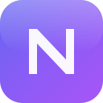

<div align="center">

# NEXA NautaX ELITE

### Extensión Chromium premium para administración de cuentas Nauta ETECSA

[](https://github.com/novacode-crypto/nexa-nautax-elite)
[](LICENSE)
[](https://developer.chrome.com/docs/extensions/mv3/intro/)
[](https://www.typescriptlang.org/)
[](https://react.dev/)
[](https://vitejs.dev/)



**Cifrado AES-256 · 100% local · Sin telemetría · 4 temas**

</div>

---

## 📋 Tabla de contenidos

- [Descripción](#-descripción)
- [Características](#-características)
- [Capturas](#-capturas)
- [Requisitos](#-requisitos)
- [Instalación](#-instalación)
- [Uso](#-uso)
- [Temas](#-temas)
- [Arquitectura](#-arquitectura)
- [Seguridad](#-seguridad)
- [Privacidad](#-privacidad)
- [Modo Demo](#-modo-demo)
- [Contribuir](#-contribuir)
- [Licencia](#-licencia)

---

## 📖 Descripción

**NEXA NautaX ELITE** es una extensión de navegador (Chrome/Edge/Brave) diseñada para gestionar cuentas Nauta de ETECSA de forma elegante, segura y eficiente. Permite conectar, desconectar y administrar múltiples cuentas Nauta desde una interfaz premium, con cifrado de grado militar y sin enviar ningún dato a servidores externos.

> ⚠️ **Nota**: Esta extensión no está afiliada con ETECSA. Es una herramienta independiente que usa el portal cautivo oficial (`secure.etecsa.net:8443`).

---

## ✨ Características

### 🔐 Seguridad
- **Cifrado AES-256-GCM** con derivación PBKDF2 (250,000 iteraciones)
- Clave derivada automáticamente — sin contraseñas maestras que recordar
- Credenciales cifradas almacenadas en `chrome.storage.local`
- Llave AES en `chrome.storage.session` (se pierde al cerrar el navegador)

### 🎨 Interfaz
- **4 temas**: Oscuro (default), Claro, Nebulosa, Aurora
- Diseño premium con glassmorphism, gradientes y animaciones fluidas
- Efecto stagger (aparición escalonada) en toda la extensión
- Tooltips tematizados via portal
- Responsive y optimizado

### 📊 Dashboard completo
- **Hero**: estado del portal ETECSA + sesión activa con cronómetro en vivo
- **Stats**: tiempo restante + saldo con alertas visuales (warning/error)
- **Estadísticas mensuales**: sesiones, tiempo total, consumo
- **Gráfico semanal**: barras clicables con modal de detalle por día
- **Últimas sesiones**: lista con filtros, URLs visitadas, historial completo
- **Detección de sesión externa**: avisa si hay internet pero no iniciado desde la extensión

### 🧑‍💻 Gestión de cuentas
- CRUD completo: crear, editar, eliminar cuentas Nauta
- Selector de cuenta con avatar personalizable
- Soporte para dominios `nauta.com.cu` y `nauta.co.cu`
- Cifrado automático de contraseñas

### 🔧 Herramientas de desarrollo
- **Logs viewer** en tiempo real con filtros por nivel
- **Connector inspector** con estado del portal ETECSA
- **Storage viewer** con exploración de `chrome.storage.local`
- **Session inspector** con tokens mascaréados
- **Modo Demo** global para previsualizar estados visuales

### 📦 Backup
- Exportación/importación de datos en JSON con checksum SHA-256
- Zona peligrosa: borrar cuentas, resetear configuración, factory reset

---

## 📸 Capturas

> Las capturas se agregarán próximamente.

---

## 🔧 Requisitos

- **Node.js** 20.x o superior
- **npm** 10.x o superior
- **Navegador Chromium**: Chrome 114+, Edge 114+, Brave

---

## 🚀 Instalación

### Desde el código fuente

```bash
# 1. Clonar el repositorio
git clone https://github.com/novacode-crypto/nexa-nautax-elite.git

# 2. Entrar a la carpeta
cd nexa-nautax-elite

# 3. Instalar dependencias
npm install

# 4. Compilar
npm run build

# 5. Cargar en Chrome
#    - Ir a chrome://extensions/
#    - Activar "Modo desarrollador"
#    - "Cargar extensión sin empaquetar"
#    - Seleccionar la carpeta dist/
```

### Scripts disponibles

| Comando | Descripción |
|---------|-------------|
| `npm run dev` | Modo desarrollo con hot reload |
| `npm run build` | Compila la extensión a `dist/` |
| `npm run typecheck` | Verifica tipos con `tsc --noEmit` |
| `npm run lint` | Ejecuta ESLint |
| `npm test` | Ejecuta tests con Vitest |

---

## 📖 Uso

### Primera vez
1. Abre la extensión (icono en la barra del navegador)
2. Selecciona tu tema preferido
3. La extensión configura el cifrado automáticamente

### Agregar cuenta
1. Abre el panel lateral (sidepanel)
2. Ve a **Cuentas** → **Agregar**
3. Introduce alias, usuario, dominio y contraseña
4. Opcional: sube un avatar (máx 512KB)

### Conectar
1. Abre el popup
2. Selecciona una cuenta del dropdown
3. Click en **Conectar**
4. La extensión se conecta a ETECSA automáticamente

### Dashboard
- Abre el panel lateral → pestaña **Dashboard**
- Verás: estado del portal, sesión activa, tiempo restante, saldo, estadísticas, gráfico semanal, últimas sesiones

---

## 🎨 Temas

| Tema | Descripción |
|------|-------------|
| **Oscuro** | Tema default, fondo oscuro con acentos morados |
| **Claro** | Fondo claro, ideal para día |
| **Nebulosa** | Tonos púrpura y rosa |
| **Aurora** | Tonos verde-azulados |

Cambia el tema desde el popup (selector en el header) o desde Settings → Apariencia.

---

## 🏗️ Arquitectura

```
nexa-nautax-elite/
├── src/
│   ├── app/
│   │   ├── popup/           # UI del popup (400×600px)
│   │   ├── sidepanel/       # UI del panel lateral
│   │   ├── background/      # Service Worker (MV3)
│   │   └── offscreen/       # Documento offscreen (audio + parsing HTML)
│   │
│   ├── components/
│   │   ├── layout/          # Layouts, headers, footers, nav
│   │   └── nexa/            # Sistema de diseño NEXA
│   │
│   ├── connectors/etecsa/   # Capa de conexión con secure.etecsa.net:8443
│   │   ├── http/            # HttpClient con retry + backoff
│   │   ├── strategies/      # 5 estrategias de scraping
│   │   ├── parsing/         # HTML parser + offscreen bridge
│   │   └── errors/          # EtecsaError + catálogo de errores
│   │
│   ├── features/
│   │   ├── onboarding/      # Flujo de bienvenida
│   │   ├── accounts/        # CRUD de cuentas
│   │   ├── dashboard/       # Dashboard completo
│   │   ├── scheduler/       # Programador de desconexiones
│   │   ├── settings/        # Configuración
│   │   ├── developer/       # Developer Mode
│   │   └── about/           # Acerca de
│   │
│   ├── services/            # Lógica de negocio
│   ├── store/               # Zustand stores
│   ├── storage/             # chrome.storage wrapper + repositorios
│   ├── themes/              # dark, light, nebula, aurora
│   └── hooks/               # Hooks personalizados
│
├── public/
│   ├── _locales/es/         # Localización en español
│   ├── fonts/               # Fuentes (DM Sans, Syne, JetBrains Mono)
│   └── icons/               # Iconos en PNG/SVG
│
├── manifest.config.ts       # Manifest V3
└── vite.config.ts           # Configuración de Vite
```

### Stack tecnológico

- **TypeScript 5.5** — type-safety end-to-end
- **React 18** — UI declarativa
- **Vite 5** — bundling ultrarrápido
- **Tailwind CSS 3** — estilos utility-first
- **Zustand 4** — estado global ligero
- **Manifest V3** — service worker efímero
- **Web Crypto API** — AES-GCM + PBKDF2
- **chrome.storage** — persistencia local
- **chrome.alarms** — scheduling sin setInterval
- **chrome.history** — URLs visitadas por sesión

---

## 🔒 Seguridad

### Cifrado
- **Algoritmo**: AES-256-GCM (Authenticated Encryption)
- **Derivación de clave**: PBKDF2 con SHA-256, 250,000 iteraciones
- **Sal**: 16 bytes aleatorios por instalación
- **IV**: 12 bytes aleatorios por cada operación de cifrado
- **Verificador**: ciphertext de un texto conocido para validar el unlock

### Almacenamiento
- Credenciales cifradas en `chrome.storage.local`
- Llave AES en `chrome.storage.session` (se pierde al cerrar navegador)
- **Cero telemetría** — nada se envía a servidores externos
- **Cero tracking** — sin analytics, sin cookies de terceros

### Conector ETECSA
- Comunicación solo con `secure.etecsa.net:8443`
- Sin intermediarios, sin proxies
- Tokens de sesión (CSRFHW, ATTRIBUTE_UUID) cifrados en storage

---

## 🛡️ Privacidad

Esta extensión **NO**:
- ❌ Envía datos a servidores externos
- ❌ Usa analytics ni telemetría
- ❌ Almacena contraseñas en texto plano
- ❌ Comparte información con terceros
- ❌ Accede a sitios que no sean ETECSA

Esta extensión **SÍ**:
- ✅ Almacena todo localmente en tu navegador
- ✅ Cifra todas las credenciales con AES-256
- ✅ Permite exportar/borrar tus datos en cualquier momento
- ✅ Funciona 100% offline para gestión de cuentas

Ver [Política de privacidad](PRIVACY.md) completa.

---

## 🧪 Modo Demo

El **Modo Demo** permite previsualizar todos los estados visuales del dashboard sin necesidad de conexión real a ETECSA.

### Cómo activarlo
1. Ve a **Settings** → activa **Developer Mode**
2. Ve a **Developer Mode** → activa **Modo Demo**
3. Ve al **Dashboard** → verás badges "Demo" en cada sección
4. Haz clic en un badge para cambiar manualmente de estado

### Estados disponibles
- **Tiempo/Saldo**: Normal → Warning → Error → Saldo bajo
- **Estadísticas**: Normal → Pocas sesiones → Mucho consumo → Sin actividad
- **Gráfico**: Normal → Bajo consumo → Pico → Sin actividad
- **Sesiones**: Normal → Pocas → Con errores → Vacío

---

## 🤝 Contribuir

Las contribuciones son bienvenidas. Para contribuir:

1. Fork el proyecto
2. Crea una rama para tu feature (`git checkout -b feature/nueva-funcionalidad`)
3. Commit tus cambios (`git commit -m 'feat: nueva funcionalidad'`)
4. Push a la rama (`git push origin feature/nueva-funcionalidad`)
5. Abre un Pull Request

### Reportar bugs
Si encuentras un bug, por favor [abre un issue](https://github.com/novacode-crypto/nexa-nautax-elite/issues) con:
- Descripción del problema
- Pasos para reproducirlo
- Versión del navegador
- Captura de pantalla (si aplica)

---

## 📄 Licencia

Este proyecto está bajo la Licencia MIT. Ver [LICENSE](LICENSE) para más detalles.

---

<div align="center">

**Hecho con ❤️ para los usuarios Nauta de Cuba**

© 2024-2026 NEXA · NautaX ELITE

[Reportar bug](https://github.com/novacode-crypto/nexa-nautax-elite/issues) · [Solicitar feature](https://github.com/novacode-crypto/nexa-nautax-elite/issues) · [Política de privacidad](PRIVACY.md)

</div>
